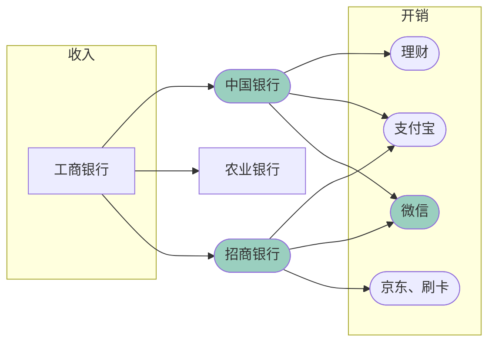

---
author : "HeYSH"
type : "post"
tags :
    - 网易有钱
    - 记账
    - Beancount
    - import
categories :
    - 折腾
    - 生活
title: "Beancount试用,半年后"
description: "冷启动，自动记账，以及“养成记账的习惯”"
date: 2019-11-07T21:58:22+08:00
lastmod: 2020-06-13T23:39+08:00
draft: false
toc: true
---
自从2017年开始，我一直使用 *网易有钱* 记账。不得不说，如果像某落水狗讲的那样，“中国人不在乎隐私”的话，这确实是一个非常好用的APP，下载账单、导入数据一气呵成，连余额宝的利息都能够算得分毫不差——

直到最近，大概是骂挨得太多，或是界面里终于塞不下更多广告，这个APP①用“维护中”挡住了所有同步按钮，并且②停止了维护。

用8元买回了本属于自己的数据后，我想起之前听说过的[Beancount](https://www.byvoid.com/zht/blog/beancount-bookkeeping-1)。于是，我给那些数据找到了一些新用途。

## 冷启动

首先，我阅读了[这篇博文](https://yuchi.me/post/beancount-intro/)，搭起了Beancount。接着，我又写了一些其它的[脚本](https://github.com/heyeshuang/beancount-homemade-importers)。

### 自动建立收支账户
### 自动建立收支账户
### 自动建立收支账户
### 自动建立收支账户
### 自动建立收支账户
### 自动建立收支账户
### 自动建立收支账户
### 自动建立收支账户
### 自动建立收支账户
### 自动建立收支账户
### 自动建立收支账户
### 自动建立收支账户

之前的理财软件大多会提供一些初始分类，比如说mint所用的类别列表在[这里](https://www.mint.com/mint-categories)。
对于本人[^self]之前的账本，有过记录的大概是这样几类：

`
{'交通,',
 '交通,打车',
 '交通,机票',
 '交通,火车',
 '人情,',
 '住房,',
 '住房,家具',
 '住房,家纺',
 '住房,物业水电',
 '住房,装修',
 '其他,',
 '医疗,',
 '医疗,药品',
 '娱乐,',
 '娱乐,电影',
 '投资亏损,',
 '文教,',
 '文教,书刊',
 '文教,文具',
 '旅行,',
 '旅行,景点门票',
 '旅行,酒店',
 '汽车,',
 '购物,',
 '购物,数码',
 '购物,日用',
 '购物,玩具',
 '购物,电器',
 '购物,美妆',
 '购物,运动用品',
 '购物,鞋服',
 '购物,饰品',
 '通讯,',
 '通讯,话费',
 '零食烟酒,',
 '零食烟酒,水果',
 '零食烟酒,烟酒',
 '零食烟酒,茶水',
 '零食烟酒,零食',
 '零食烟酒,饮料',
 '餐饮,',
 '餐饮,三餐',
 '餐饮,食材'}
`

对这些分类，利用人工~~智能~~，为每一项建立了对应的`account`，形成了一个[dict](https://github.com/heyeshuang/beancount-homemade-importers/blob/master/importers/youqian/youqianDict.py)。

如果你已经下载了[beancount-homemade-importers](https://github.com/heyeshuang/beancount-homemade-importers)，你可以用里面的`importers/
youqian/accountInit.py`来自动建立这些`accounts`：

```bash
python importers/youqian/accountInit.py > New_Accounts.bean
# 或：如果之前已经建立了一些账户的话
python importers/youqian/accountInit.py Existing_Accounts.bean > New_Accounts.bean
```

### 导入网易有钱的收入、支出数据

Beancount的[文档](https://docs.google.com/document/d/11EwQdujzEo2cxqaF5PgxCEZXWfKKQCYSMfdJowp_1S8/edit#)里已经对导入脚本进行了比较详细的说明。从[这个例子](https://bitbucket.org/blais/beancount/src/tip/examples/ingest/office/importers/utrade/)开始，基本上只要实现几个函数就行。

在[beancount-homemade-importers](https://github.com/heyeshuang/beancount-homemade-importers)中，我写了一个简单的网易有钱导入脚本。在使用之前，需要用excel把默认的`xlsx`格式转换为`收入.csv`和`支出.csv`。

之后，使用

```
bean-extract importers/youqian/youqian_expense.import documents.tmp/支出.csv > 支出.bean
bean-extract importers/youqian/youqian_income.import documents.tmp/收入.csv > 收入.bean
```

来导入。

## 自动记账

写下这个标题是在2020年6月。在使用beancount半年之后，账本一共增加了270条内容，所需的时间每月不超过1小时。


### 梳理资金的流向

作为一个单身工薪族，我的~~主要~~全部收入来自于工资，在经过一些卡片后，从微信、支付宝和其他地方流走。


{}

{}

其中，有一些银行卡（比如图中的农业银行）每月的转账记录不超过2条，这时候只要手工敲上几行就可以了。对于另外的、日常生活的花费，手动记录带来了大量时间的浪费。这时候，找到流动的枢纽，并对它们的账单进行批量处理，就可以从重复劳动中解放出来。对于我来说，要进行批量处理的节点是`中国银行`，`招商银行`和`微信`。[^alipay]

### 写一些脚本

所以，我写了中国银行、招商银行和微信钱包对账单的导入脚本。Beancount拥有比较强大的导入功能，对于简单的、CSV格式的账单文件，只要在自带的`beancount.ingest.importers.csv.importer`上[稍作修改](https://github.com/heyeshuang/beancount-homemade-importers/blob/master/importers/boc.import)就可以了；对于其它较为复杂的账单，可以自行扩展`ImporterProtocol`的子类，在[官方文档](https://docs.google.com/document/d/11EwQdujzEo2cxqaF5PgxCEZXWfKKQCYSMfdJowp_1S8/edit#heading=h.z153vh2ll6ix)中有较为详细的说明。

另外，我还发现了[smart_importer](https://github.com/beancount/smart_importer)，只要简单地增加hook，就可以给导入脚本增加更好的去重、智能猜测分类等更帅气的功能。

### 在每个账单日运行一次

在账单目录下，我建立了一个`TODO`文件：

```
自动导入微信、中国银行和招商（账单日）
手动导入工行和农行
```
因为微信的账单信息比较多，我一般先从它开始。每月信用卡的账单日，下载微信钱包对账单，然后运行：

```bash
bean-extract importers/wechat.import documents.tmp/微信支付账单.csv -f main.bean > temp.bean 
```

其中，`-f`用来为`smart_importer`提供学习素材。

接下来打开`temp.bean`，检查人工~~智障~~智能补充的分类条目有没有什么问题。（大概率问题很多，每个月大部分的时间会花费在这里。）

之后，将`temp.bean`重命名为一个有意义的名字，并在`main.bean`中`import`。接下來对银行账户的导入过程中，`smart_importer`会自动去除重复账单。

在上面的工作都完成以后，本月的账单也只剩下几条漏网之鱼了。把它们（手动）补充，并用`balance`命令检查。


### 并养成“记账的好习惯”

在某些问答网站上，在“相见恨晚的习惯”列表，记账大概能排在top10的位置；同时，在“半途而废的习惯”里，位置大概也在附近。原因并不仅仅是“缺乏自制力”，而是手动记账花费了太多时间，而效果并不是立竿见影的。在付出和反馈不成比例时，放弃就成了唯一的选择。

如果每个月只要十几分钟就可以获得成就感，习惯也就自然地养成了。

## 又及

> 我跟你港，这次的内容超适合作Python教程的，还能顺便学英语！只要学会了这个，年薪百万不是梦！

> 现在诚征 100 个~~凯子~~幸运读者给我打钱，我的支付宝是：……

> 呃，对不起。

以上不代表博主观点。


[^self]:一个普通的、抠抠索索的中青年男性，未婚，不修边幅，被阳光照到会燃烧。
[^alipay]:细心的读者可能会注意到，我并没有将支付宝也列入进来，即使和微信的地位相似。这是由于支付宝的账单并不能显示付款账户。通过余额宝和通过信用卡支付，在对账单上没有明确的区分，这会给之后的条目合并造成困难。在开始用beancount之后，因为手动记录太麻烦，我很少用支付宝付款。